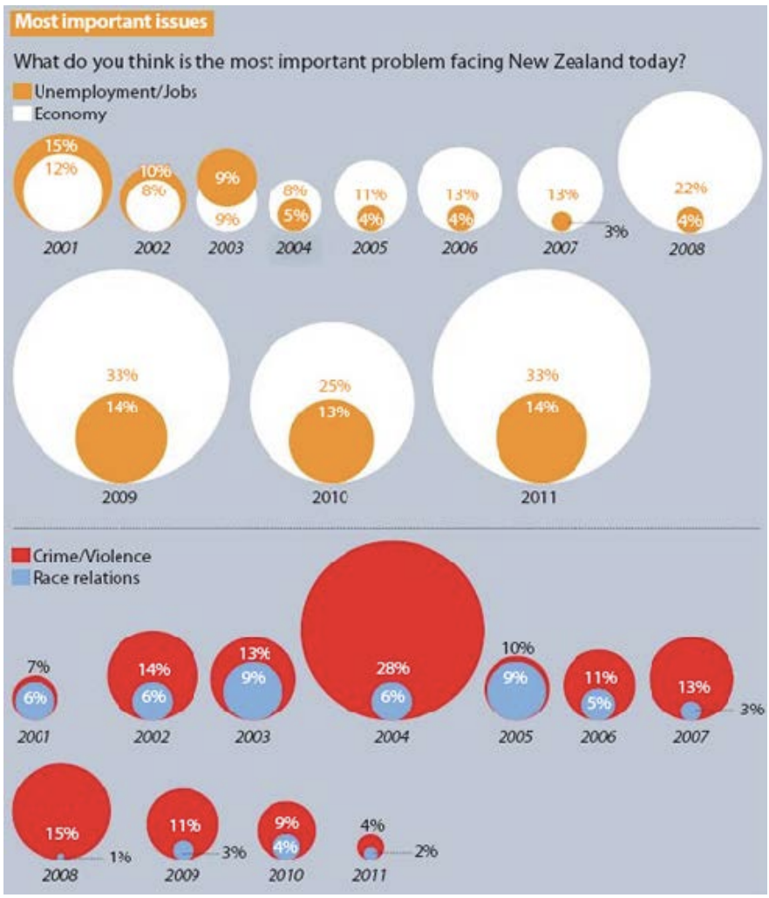

# Exercises

**What questions does this visualization answer?**  
Answer form a questionnaire asking what people think is the most important problem in NZ
1. Jobs/unemployment vs Economy
2. Crime/violence vs race relations 

**What data is represented in this visualization? Be specific.**  
Year - time Pect answers regarding “jobs/unemployment”, “Economy”, “Crime/violence” and “race relations” 

**How is each data type visually encoded?**  
* Year
* “jobs/unemployment”, “Economy”, “Crime/violence” and “race relations” - text and size
* Color
* Circle size

**Is the visual encoding appropriately chosen?**    
Nope

**What could be the goals of the designer?**   
Showcasing people is more interested in: 
* Economy vs jobs/unemployment
* Crime/violence vs race

**Can you read the data precisely? Would this work without labels?**  
Not without the labels

**Why do you like / dislike this visualization?**  
* Like
  * Labels
* Dislike
  * Everything else
  * They don’t go up to 100 percent

**Improvements:**  
* We would use a stacked bar chart (100% Stacked (Horizontal) Bar Graph)
* x = year
* Bar length represents values
* Time = Lines

